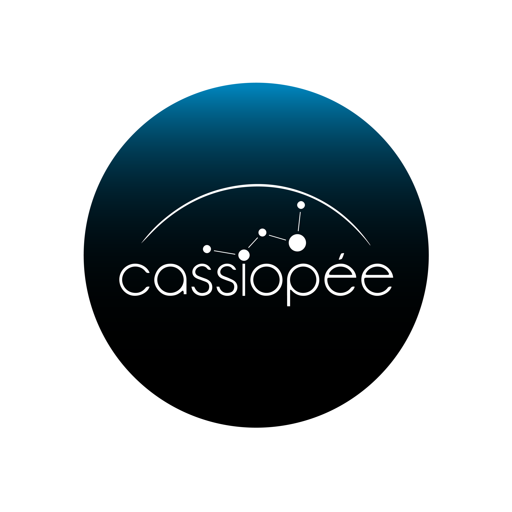

# 🌌 Projet Cassiopée

## 🖐 Self-supervised learning with deep neural networks for automatic gesture recognition
Gesture is an important means of non-verbal communication that facilitates many human interactions in different contexts, including driving or communicating with disabled people. It is therefore essential to acquire the ability to automatically recognise this means of communication in order to improve human-computer interactions.

Current progress in the development of automatic recognition of human gestures has accelerated but is hampered by the costly human annotation required to establish the necessary dataset. One solution to this problem is to use self-supervised learning, which extends the learning process applied to unlabelled data. This methodology has been widely applied to several other computer vision tasks, but its application to gesture recognition, particularly in a multimodal context, is still limited.

## 👥 Team
- ALLEMAND Fabien
- MAZZELLA Alessio
- VILLETTE Jeanne